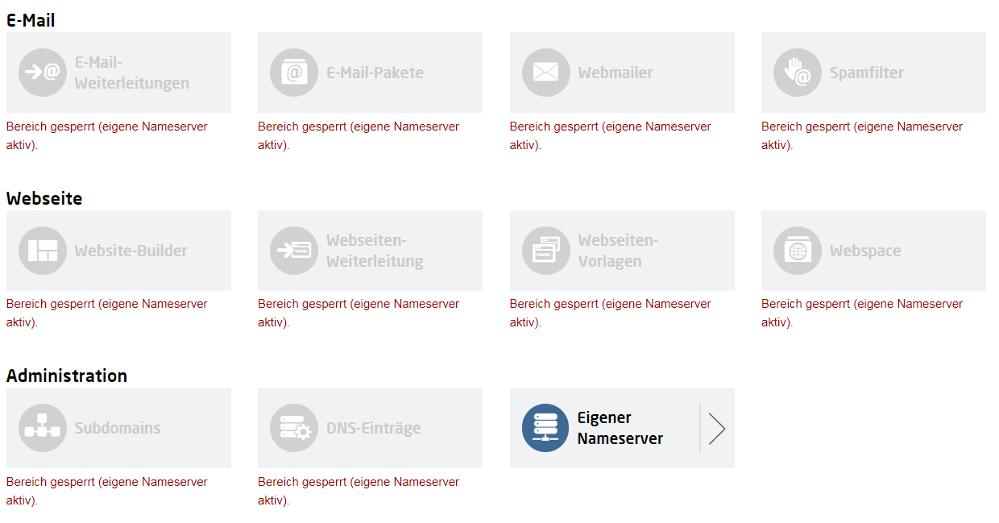
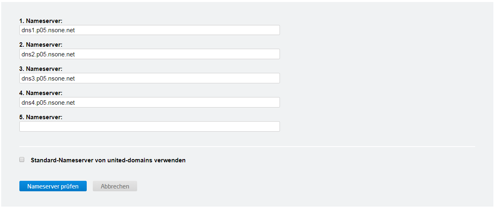

+++
title = "Hosting on Netlify"
description = ""
date = "2019-01-08"
slug = ""
categories = ["tech"]
tags = ["web", "jamstack", "hugo"]
draft = true
+++

# Hosting your Website on Netlify

Netlify offers hosting and serverless backend services for static Websites.

## Use your own Domain

